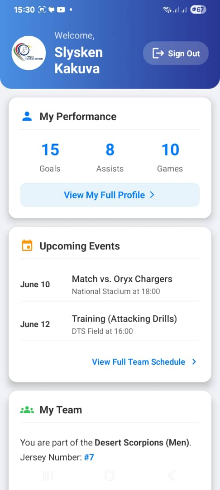
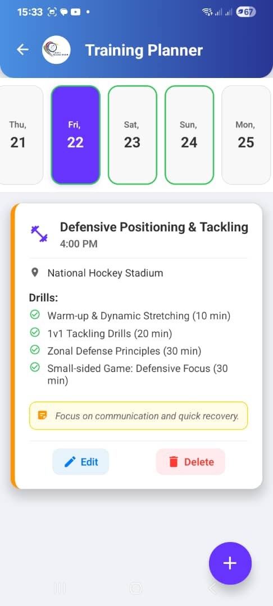
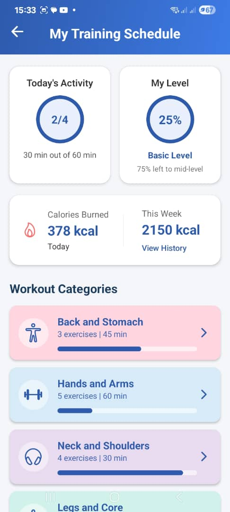
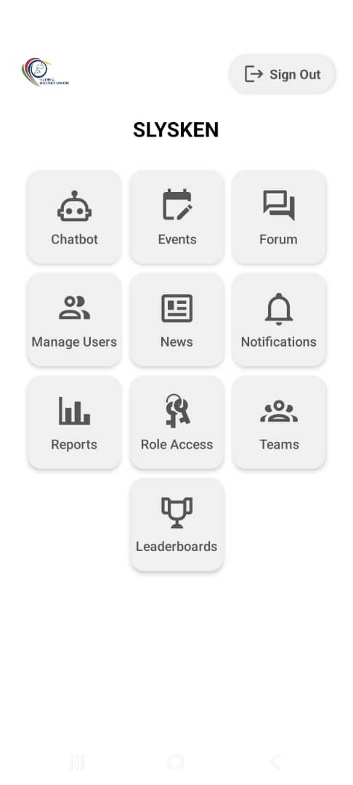
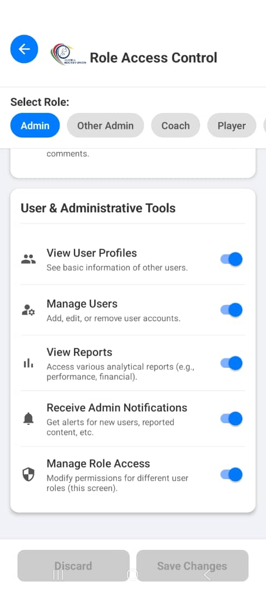

---

# 🏒 HockeyUnionApp

Welcome to **HockeyUnionApp** – your all-in-one mobile solution for managing and exploring hockey teams, matches, and league activities.  
Built with [Expo](https://expo.dev), this app runs seamlessly across **Android**, **iOS**, and the **web**.

---

## 🚀 Features

- 📅 **Match Scheduling** – Stay updated with upcoming games and events  
- 🏆 **Team Management** – Browse team rosters and player statistics  
- 📊 **Live Scores** – Get real-time match updates  
- 🖼️ **Modern UI** – Sleek, responsive design for all screen sizes  
- 🌐 **Cross-Platform** – Unified experience on mobile and web  

---

## 📱 Screenshots

|  |  |  |
|-------------------------------------------|-------------------------------------------|-------------------------------------------|
|  |  |  |
|-------------------------------------------|-------------------------------------------|-------------------------------------------|
|  |


---

## 🛠️ Installation & Setup

1. **Clone the repository**
   ```bash
   git clone https://github.com/slyskenk/HockeyUnionApp.git
   cd HockeyUnionApp
   ```

2. **Install core dependencies**
   ```bash
   npm install --force
   ```

3. **Install additional packages**
   ```bash
   npm install @google/generative-ai --force
   npm install --save-dev dotenv --force
   npm install expo-linear-gradient @expo/vector-icons react-native-dotenv --force
   npm install expo-constants @expo/vector-icons --force
   npm install --save-dev @types/react-native --force
   npm install tslib --force
   expo install @react-native-picker/picker --force
   ```

4. **Start the app**
   ```bash
   npx expo start
   ```

---


## 📂 Project Structure

```
HockeyUnionApp/
├── app/              # Main app directory (file-based routing)
├── assets/           # Images, fonts, etc.
├── components/       # Reusable UI components
├── package.json
└── README.md
```

---

## 📖 Learn More

- [Expo Documentation](https://docs.expo.dev/)
- [React Native Docs](https://reactnative.dev/)
- [Expo Router Guide](https://docs.expo.dev/router/introduction/)

---

## 📜 License

This project is licensed under the **MIT License**.

---

## 🌟 Show Your Support

If you find this project helpful, please consider giving it a ⭐ on GitHub!

---

